# Introdução

Informações básicas do projeto.

* **Projeto:** MatchMyPet
* **Repositório GitHub:** https://github.com/ICEI-PUC-Minas-PPLES-TI/plf-es-2026-1-ti1-7641100-save-dogs
* **Membros da equipe:**

  * Henrique Santos de Souza
  * Arthur Lopes Teixeira
  * Guilherme Henrique de Oliveira Resende
  * Pedro Aguiar Santos Vianna Gouvea

A documentação do projeto é estruturada da seguinte forma:

1. Introdução
2. Contexto
3. Product Discovery
4. Product Design (**A entrega da fase de Concepção finaliza aqui**)
5. Requisitos
6. Metodologia
7. Solução
8. Referências Bibliográficas

✅ [Documentação de Design Thinking (MIRO)](files/processo-dt.pdf)

# Contexto

Este projeto, desenvolvido como parte do Trabalho Interdisciplinar, visa abordar o problema do abandono de animais. Muitos cães e gatos vivem abandonados nas ruas sem cuidados básicos. Apesar de existirem pessoas dispostas a resgatar e adotar esses animais, falta uma forma organizada de conectar quem precisa de ajuda com quem pode ajudar. O projeto propõe a criação de uma plataforma que conecta animais em situação de vulnerabilidade com pessoas e instituições dispostas a contribuir para seu resgate, cuidado e adoção.

## Problema

O abandono de animais, especialmente cães e gatos, é um problema crescente nas grandes cidades brasileiras. Milhares de animais vivem em situação de rua, sem acesso a alimentação, cuidados veterinários ou abrigo. Embora haja um grande número de pessoas e instituições dispostas a ajudar, existe uma lacuna na comunicação e organização que dificulta o processo de resgate e adoção. Essa falta de coordenação resulta em sofrimento animal e frustração para aqueles que desejam contribuir. A aplicação busca mitigar esse problema ao fornecer uma plataforma centralizada para facilitar a interação entre os diversos atores envolvidos.

## Objetivos

O objetivo geral deste trabalho é desenvolver um software que solucione o problema do abandono de animais, conectando de forma eficiente resgatadores, adotantes e clínicas veterinárias. Os objetivos específicos incluem:

1. **Facilitar a comunicação:** Criar um canal eficaz para que resgatadores possam divulgar animais necessitados e adotantes possam encontrar animais para adoção.

2. **Otimizar o processo de adoção e resgate:** Simplificar as etapas envolvidas no resgate e adoção, tornando-as mais transparentes e acessíveis.

## Justificativa

A escolha deste projeto é motivada pela urgência e relevância do problema do abandono animal no Brasil. A ausência de uma plataforma integrada que centralize as informações e facilite a interação entre os envolvidos gera ineficiência e sofrimento desnecessário. Acreditamos que, ao focar na facilitação da comunicação e na otimização dos processos de resgate e adoção, podemos gerar um impacto social positivo significativo, contribuindo para o bem-estar animal e para a conscientização da sociedade. A pesquisa realizada para este projeto revelou que a maioria dos animais abandonados está nas ruas, e não em abrigos, evidenciando a necessidade de soluções que alcancem diretamente esses animais e seus potenciais cuidadores.


## Público-Alvo

O público-alvo da solução do nosso projeto é composto por:

* **Resgatadores de Animais:** Indivíduos ou grupos que resgatam animais em situação de rua e buscam apoio para sua recuperação e adoção.

* **Adotantes Potenciais:** Pessoas interessadas em adotar um animal, buscando segurança, informações claras e um processo facilitado.

* **Clínicas Veterinárias e Profissionais:** Estabelecimentos e profissionais que desejam oferecer serviços e demonstrar responsabilidade social, atraindo novos clientes e contribuindo para a causa animal.


# Product Discovery

## Etapa de Entendimento

Nessa etapa, utilizamos a metodologia de Design Thinking para compreender com maior profundidade o problema do abandono animal. Foram elaborados os seguintes artefatos:

### Matriz CSD

A Matriz de Alinhamento CSD (Certezas, Suposições e Dúvidas) foi construída coletivamente pela equipe para organizar o conhecimento prévio sobre o problema e direcionar as etapas seguintes da pesquisa.

Entre as **certezas** levantadas, destacam-se: a existência de muitas pessoas dispostas a ajudar mas que não sabem como; a preferência por adoção de cães de raça em detrimento de vira-latas; e a grande visibilidade nacional da causa animal. Nas **suposições**, o grupo identificou que existem pessoas e famílias que desejam adotar um animal mas que seriam beneficiadas por uma plataforma que facilitasse esse processo, e que o projeto possui potencial nacional e internacional. Já nas **dúvidas**, foram levantadas questões como a necessidade de proteção jurídica, formas de incentivar veterinários a participar, e como lidar com animais agressivos.

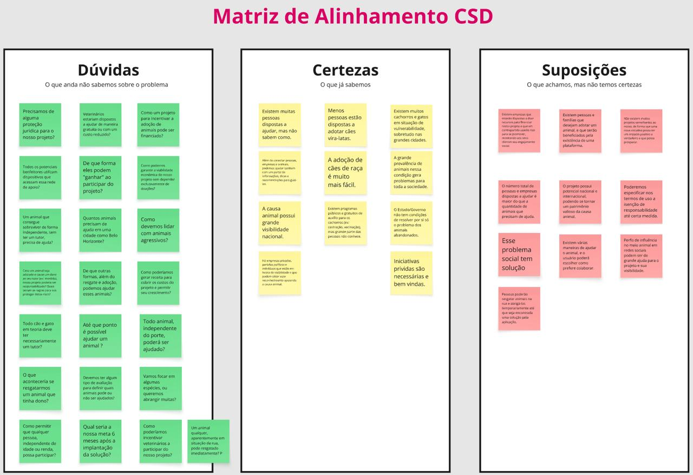

### Mapa de Stakeholders

O mapa de stakeholders permitiu identificar e categorizar os principais envolvidos no problema, organizados por nível de proximidade com a solução:

* **Fundamentais:** Famílias e pessoas que desejam adotar animais de forma permanente; famílias e pessoas que estão dispostas a resgatar um animal e encaminhá-lo para adoção; empresas que podem contribuir via doações ou prestação de serviços.
* **Importantes:** Clínicas Veterinárias, ONGs que atuam em causas parecidas, Centros Públicos de Castração e Centro de Controle de Zoonoses.
* **Influenciadoras:** Influencers em redes sociais e Subsecretaria de Bem-Estar Animal (SUDECAP/Prefeitura).

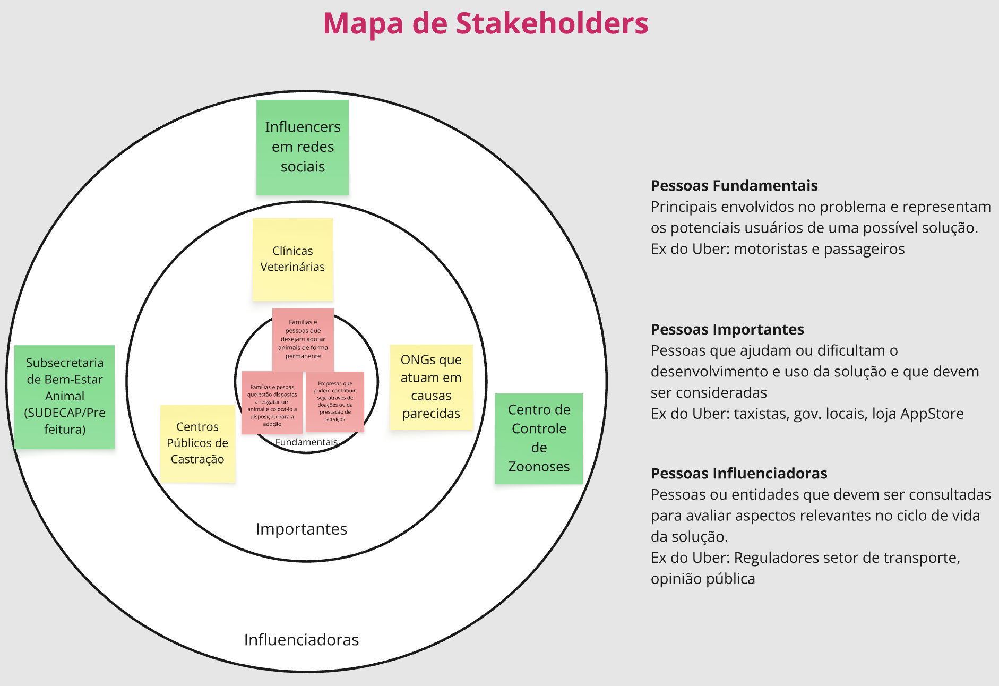

### Entrevistas Qualitativas

Foram realizadas entrevistas qualitativas com pessoas representativas dos perfis de stakeholders identificados, com o objetivo de validar suposições e esclarecer dúvidas mapeadas na Matriz CSD. As entrevistas abordaram temas como experiências com resgate e adoção, dificuldades encontradas no processo, canais utilizados atualmente e expectativas em relação a uma plataforma digital para a causa.

### Highlights de Pesquisa

A partir das entrevistas e da pesquisa realizada, foram compilados os principais insights:

* **O que mais surpreendeu:** Apenas uma pequena parte dos animais abandonados vive em abrigos, enquanto a grande maioria permanece nas ruas. Isso mostra que os abrigos existentes são insuficientes. Além disso, o estudo analisou centenas de fontes e milhares de entrevistas, mostrando que o abandono é um problema global.
* **Aspectos mais importantes:** A falta de dados completos e atualizados sobre abandono animal; a necessidade de políticas públicas e iniciativas privadas para lidar com o problema; e a importância de dados para planejamento de ações de resgate e controle populacional.
* **Principais aprendizados:** É necessário combinar resgate, adoção e controle populacional (castração). A participação da sociedade civil e ONGs é fundamental, reforçando a importância dos stakeholders identificados no mapa.
* **Novos tópicos a explorar:** Como melhorar a coleta de dados sobre animais abandonados? Como integrar ONGs, clínicas veterinárias e voluntários em uma rede digital? Como medir o impacto real da plataforma?

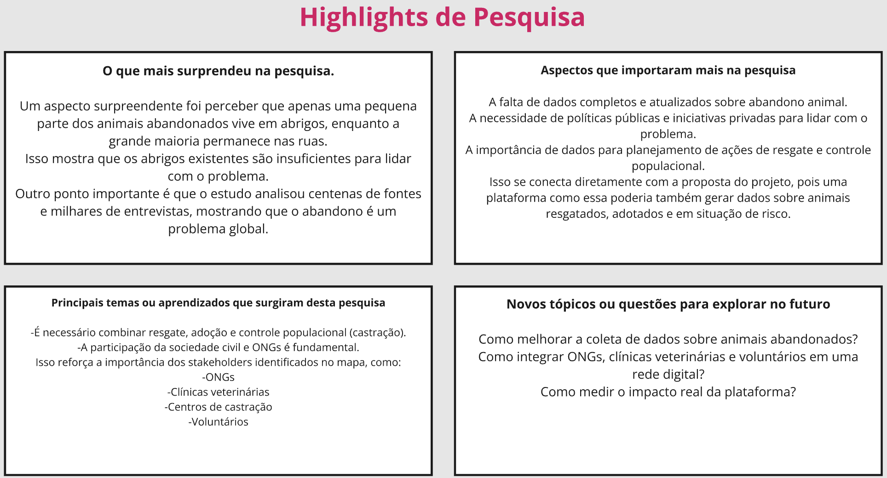

## Etapa de Definição

### Personas

Com base nas pesquisas e entrevistas realizadas, foram definidas três personas que representam os principais perfis de usuários da plataforma MatchMyPet. Cada persona inclui um mapa de empatia detalhado.

##### Persona 1 — Ana Clara (Resgatadora/Hospedeira)

Ana Clara, 35 anos, publicitária. Tranquila e estudiosa, gosta de passar tempo com sua família e pets, além de viajar e apreciar a natureza. Seu objetivo ao utilizar o serviço é hospedar animais momentaneamente e/ou adotar um animal. Valoriza uma comunicação tranquila, objetiva e transparente. Seu sonho é ajudar o mundo a ser um lugar melhor para todos.

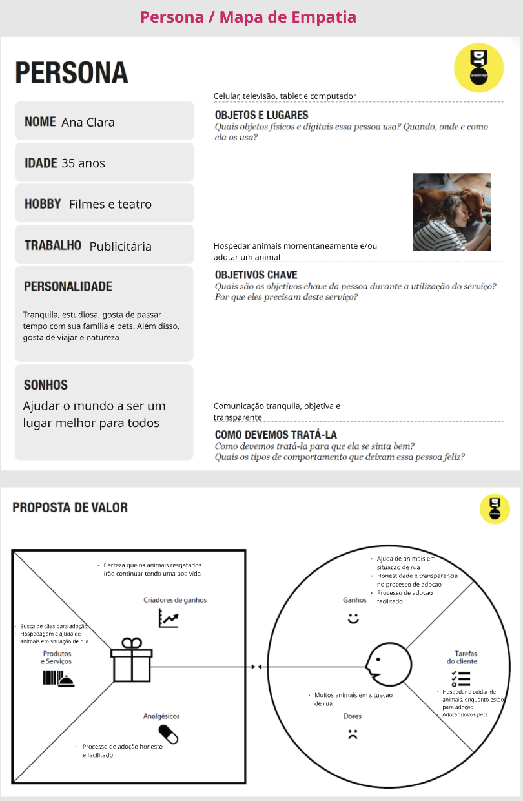

##### Persona 2 — Lucas Ferreira (Adotante)

Lucas Ferreira, 27 anos, desenvolvedor. Analítico e cauteloso, tem como hobby tecnologia e jogos. Utiliza celular, sites, apps e redes sociais no dia a dia. Seu objetivo chave é adotar com segurança e ter informações claras do animal. Espera transparência, informações completas e um processo confiável. Seu sonho é ter um pet saudável e companheiro.

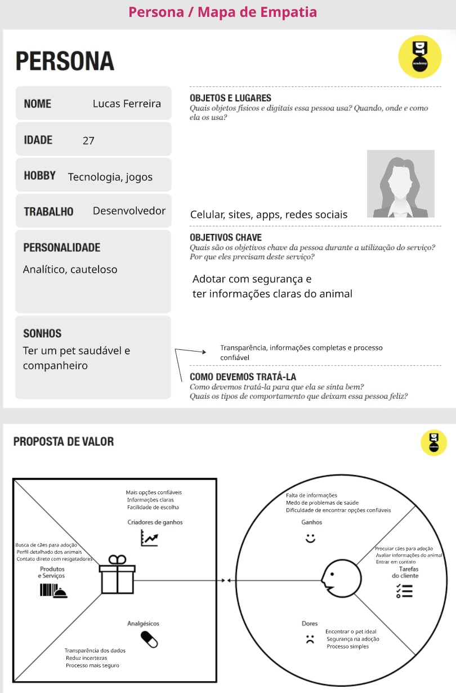

##### Persona 3 — Mariana Costa (Veterinária)

Mariana Costa, 40 anos, veterinária. Prática e organizada, utiliza o sistema da clínica, agenda e redes sociais. Seu objetivo chave é organizar atendimentos e atrair clientes. Valoriza um sistema organizado, com controle e visibilidade. Seu sonho é ajudar mais animais sem prejudicar o negócio.

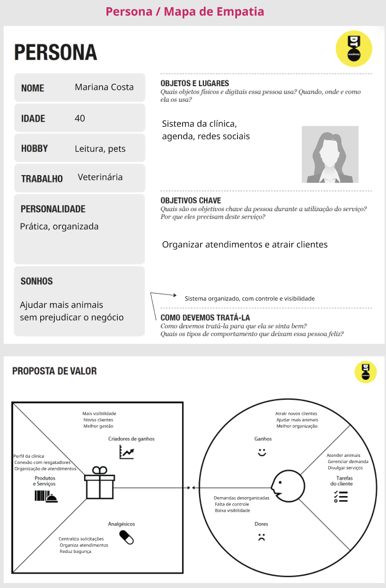

# Product Design

Nesse momento, transformamos os insights e validações obtidos na etapa de Discovery em soluções tangíveis e utilizáveis. Essa fase envolve a definição de uma proposta de valor, a criação de histórias de usuários, wireframes e um protótipo interativo que detalham a interface e a experiência do usuário.

## Histórias de Usuários

Com base na análise das personas, foram identificadas as seguintes histórias de usuários, agrupadas por perfil:

| EU COMO... | PRECISO DE... | PARA... |
| --- | --- | --- |
| Resgatador de cachorros e gatos de rua | Uma rede vasta com animais para resgatar e pessoas para adotá-los | Ter a expectativa de que poderei resgatar o animal sem necessariamente ficar com ele para sempre |
| Resgatador de cachorros e gatos de rua | Incentivos como descontos em serviços veterinários ou divulgação da minha empresa | Que o processo de resgate seja viável de alguma forma para mim |
| Resgatador de cachorros e gatos de rua | Uma ferramenta onde se compartilhe informações de animais que foram abandonados ou estão em situação de rua | Que eu possa agir e resgatar animais antes que eles sofram com acidentes (ex: atropelamento) ou doenças |
| Adotante de animais resgatados | Saber a verdadeira situação de saúde física e mental do animal que está disponível para adoção | Que eu possa adotar com menos riscos e maior chance de sucesso |
| Adotante de animais resgatados | Conhecer o custo estimado para cuidar de um animal | Que eu possa avaliar se realmente tenho condições financeiras para adotar de forma responsável |
| Adotante de animais resgatados | Um grande leque de opções de animais disponíveis para adoção | Escolher um animal que seja adequado para a minha família e minha residência (ex: casa vs. apartamento, porte do animal, raça, etc) |
| Veterinário ou Dono de clínica veterinária | Demonstrar responsabilidade social com animais abandonados e resgatados | Promover a minha empresa e a minha marca |
| Veterinário ou Dono de clínica veterinária | Instruir possíveis resgatadores e adotantes de animais sobre os cuidados necessários nesse processo | Aumentar as chances de sucesso e criar conexões com novos potenciais clientes |

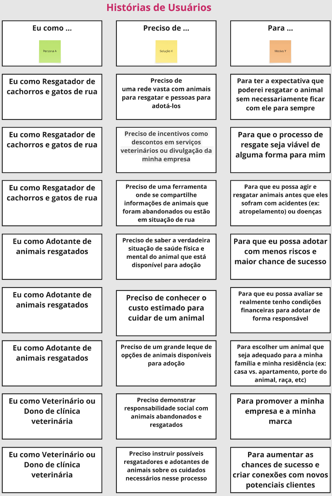

## Proposta de Valor

Para cada persona foi elaborado um Canvas de Proposta de Valor, detalhando os produtos e serviços oferecidos, os aliviadores de dor e os criadores de ganho, em contraste com as tarefas, dores e ganhos esperados pelo cliente.

##### Proposta de Valor — Ana Clara (Resgatadora/Hospedeira)

A proposta de valor para Ana Clara foca em oferecer busca de cães para adoção, hospedagem e ajuda de animais em situação de rua. Como aliviadores de dor, o processo de adoção é honesto e facilitado. Os criadores de ganho incluem a certeza de que os animais resgatados irão continuar tendo uma boa vida.


##### Proposta de Valor — Lucas Ferreira (Adotante)

Para Lucas, a proposta de valor oferece busca de cães para adoção, perfil detalhado dos animais e contato direto com resgatadores. Os aliviadores de dor são a transparência dos dados, redução de incertezas e um processo mais seguro. Como criadores de ganho: mais opções confiáveis, informações claras e facilidade de escolha.


##### Proposta de Valor — Mariana Costa (Veterinária)

Para Mariana, a proposta de valor inclui perfil da clínica, conexão com resgatadores e organização de atendimentos. Os aliviadores de dor são a centralização de solicitações, organização dos atendimentos e redução de bagunça. Os criadores de ganho oferecem mais visibilidade, novos clientes e melhor gestão.


## Projeto de Interface

Artefatos relacionados com a interface e a interação do usuário na proposta de solução.

### Wireframes

Estes são os protótipos de telas do sistema, desenvolvidos para representar a estrutura e o layout das principais funcionalidades da plataforma MatchMyPet.

##### Tela Home

Página inicial da plataforma, com banner principal contendo chamadas para ação ("Adotar agora" e "Cadastrar resgate"), seção sobre a missão do projeto e apresentação da equipe. O menu de navegação oferece acesso a todas as funcionalidades: Adotar, Resgatar, Produtos, Clínicas, Ranking, Parcerias e Contato.

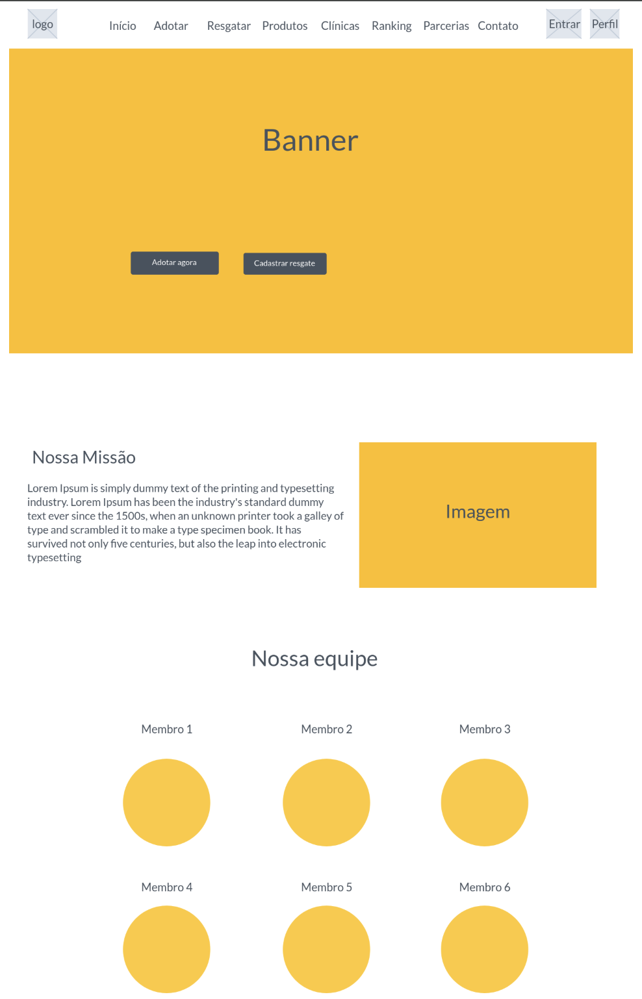

##### Tela de Login

Tela de autenticação do usuário com campos de e-mail e senha, opção "lembrar de mim", link para recuperação de senha e opção de cadastro para novos usuários.

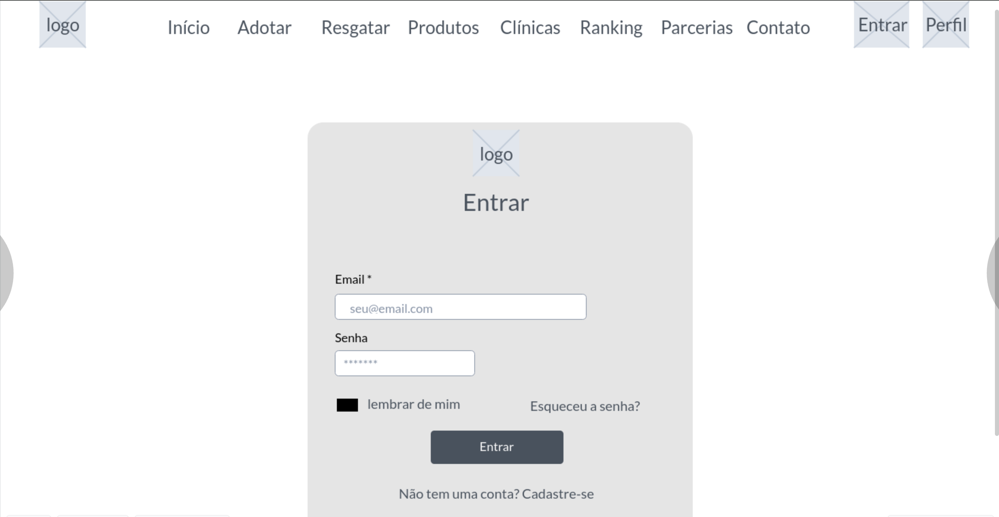

##### Tela de Cães para Adoção

Página de listagem de animais disponíveis para adoção, com sistema de filtros por nome, porte (Pequeno, Médio, Grande), idade (Filhote, Adulto) e localização (Belo Horizonte, São Paulo, Rio de Janeiro). Os animais são exibidos em formato de cards com imagem.

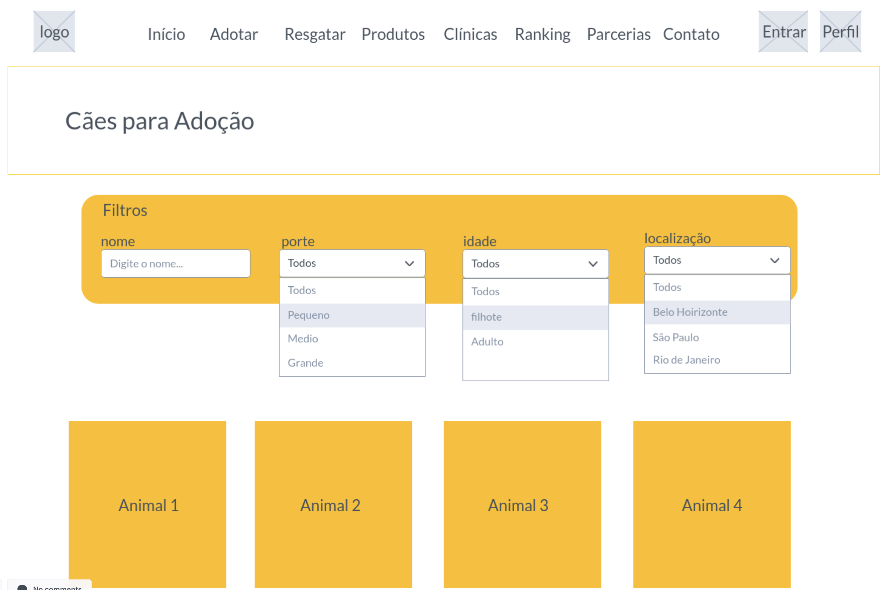

##### Tela de Busca e Filtros

Tela de busca avançada que permite ao usuário refinar a pesquisa de animais utilizando múltiplos critérios simultaneamente, facilitando encontrar o animal mais adequado ao perfil do adotante.

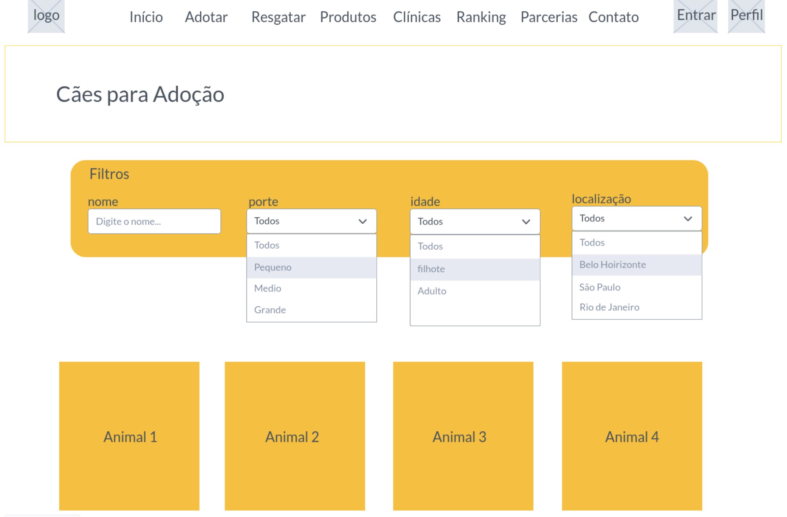

##### Perfil do Usuário

Página de perfil do usuário com foto, biografia, localização, dados de contato e estatísticas de atividade na plataforma (resgates realizados, adoções concluídas, doações e taxa de adoção). Exibe também os animais vinculados ao perfil.

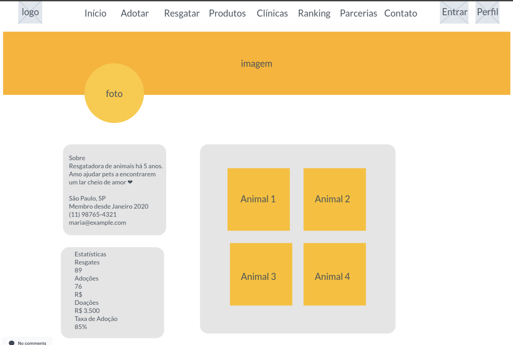

##### Clínicas Veterinárias Parceiras

Página de listagem das clínicas veterinárias parceiras da plataforma. Cada card exibe o nome da clínica, selo de "Parceiro Oficial", endereço, telefone, horário de funcionamento, avaliação e especialidades (Cirurgia, Consultas, Vacinação). Destaque para o benefício de 20% de desconto para animais adotados através do site.

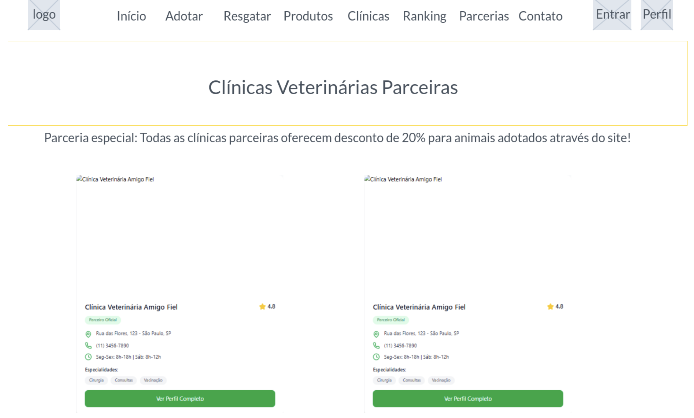

##### Tela de Contato

Formulário de contato com campos para nome completo, e-mail, telefone, assunto e mensagem. Ao lado, são exibidas as informações de contato da plataforma (e-mail, telefone, WhatsApp, endereço) e o horário de atendimento.

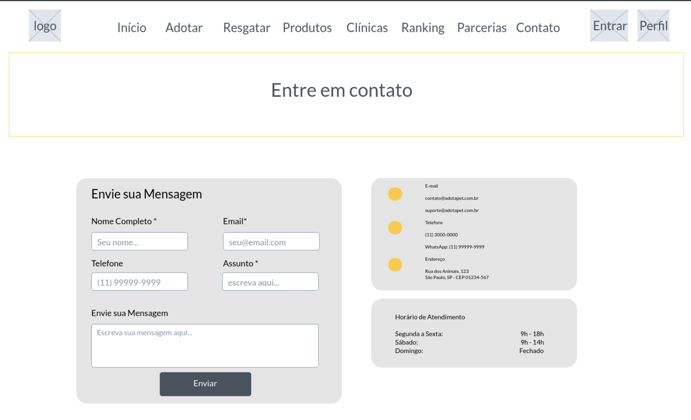

### User Flow

O diagrama de fluxo de telas abaixo apresenta a navegação completa da plataforma MatchMyPet. A partir da tela Home, o usuário pode acessar todas as funcionalidades principais: listagem de cães para adoção, cadastro de animais para adoção, busca de produtos para pets, clínicas veterinárias parceiras, perfil do usuário, ranking de contribuidores, página de parcerias, contato e tela de login/cadastro. As setas indicam os caminhos de navegação possíveis entre as telas.

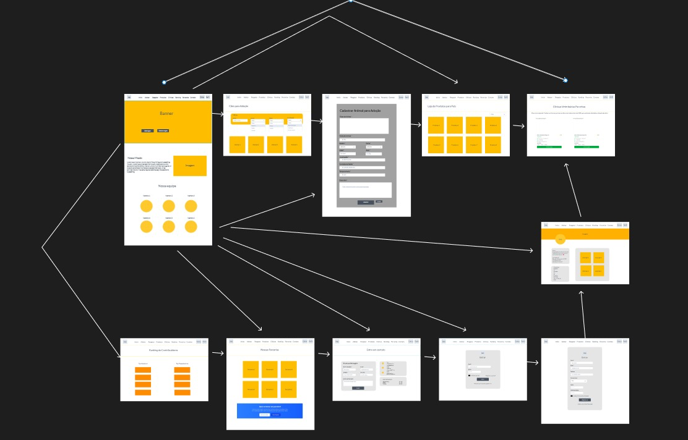

### Protótipo Interativo

O protótipo interativo foi desenvolvido no MarvelApp e permite navegar pelas telas da plataforma MatchMyPet como se fosse o software pronto, simulando a experiência completa do usuário.

✅ [Protótipo Interativo (MarvelApp)](https://marvelapp.com/prototype/843512a/screen/98665934)

# Requisitos

A partir das histórias de usuários e da proposta de valor, foram definidos os requisitos do sistema.

## Requisitos Funcionais

| ID | Requisito Funcional | Prioridade |
| --- | --- | --- |
| RF01 | O sistema deve permitir o cadastro de novos usuários | Alta |
| RF02 | O sistema deve permitir a autenticação (login e logout) de usuários | Alta |
| RF03 | O sistema deve permitir que um usuário logado cadastre animais para adoção | Alta |
| RF04 | O sistema deve exibir o perfil do usuário com seus dados e animais cadastrados | Alta |
| RF05 | O sistema deve calcular e exibir estatísticas do usuário (resgates, adoções e taxa de adoção) | Média |
| RF06 | O sistema deve apresentar um catálogo de produtos para pets com filtro por categoria | Alta |
| RF07 | O sistema deve permitir adicionar e remover produtos de um carrinho de compras | Alta |
| RF08 | O sistema deve permitir finalizar a compra, registrando um pedido | Alta |
| RF09 | O sistema deve exibir um ranking de resgatadores e casos de sucesso | Média |
| RF10 | O sistema deve permitir reportar um animal em situação de rua | Média |
| RF11 | O sistema deve disponibilizar um formulário de contato | Baixa |
| RF12 | O sistema deve permitir a troca de mensagens entre usuários | Média |
| RF13 | O sistema deve permitir o ajuste de preferências do usuário (modo escuro, idioma e perfil) | Baixa |

## Requisitos Não Funcionais

| ID | Requisito Não Funcional | Prioridade |
| --- | --- | --- |
| RNF01 | A aplicação deve ser responsiva, adaptando-se a desktop e dispositivos móveis | Alta |
| RNF02 | A interface deve ser intuitiva e seguir um padrão visual consistente | Alta |
| RNF03 | O back-end deve expor uma API RESTful baseada em JSON Server | Alta |
| RNF04 | A persistência de dados deve ser feita no arquivo `db.json` | Alta |
| RNF05 | A sessão do usuário deve ser mantida no navegador via `sessionStorage` | Média |
| RNF06 | O sistema deve ser executável localmente com Node.js (`npm install` e `npm start`) | Alta |
| RNF07 | O código deve ser versionado no GitHub | Alta |

## Rastreabilidade (Histórias de Usuário → Requisitos)

| Persona / Perfil | História de usuário (resumo) | Requisitos atendidos |
| --- | --- | --- |
| Resgatador | Divulgar animais resgatados para adoção | RF02, RF03, RF04 |
| Resgatador | Receber incentivos e reconhecimento pelo resgate | RF09 |
| Resgatador | Compartilhar informações de animais em situação de rua | RF10 |
| Adotante | Saber a situação de saúde do animal disponível | RF03, RF04 |
| Adotante | Ter um grande leque de opções de animais | RF04 |
| Adotante / Tutor | Adquirir produtos para o pet | RF06, RF07, RF08 |
| Veterinário/Clínica | Demonstrar responsabilidade social e atrair clientes | RF09, RF11 |
| Todos os perfis | Comunicar-se com outros usuários da plataforma | RF12 |

# Metodologia

O desenvolvimento do projeto foi realizado utilizando a abordagem de Design Thinking, com foco na resolução de problemas reais relacionados ao resgate e adoção de cães de rua.

Inicialmente, a equipe buscou compreender o problema por meio da etapa de imersão, analisando as dificuldades enfrentadas por resgatadores, adotantes e clínicas veterinárias. Em seguida, foi feita a definição do problema, identificando a falta de conexão e organização entre esses três grupos.

Na fase de ideação, foram discutidas possíveis soluções, chegando à proposta de uma plataforma digital que conecta resgatadores, adotantes e clínicas veterinárias.

Após isso, foi desenvolvido um protótipo interativo utilizando a ferramenta MarvelApp, permitindo a visualização do funcionamento do sistema e das principais funcionalidades.

Paralelamente, foi iniciado o desenvolvimento técnico do sistema, com versionamento de código no GitHub e utilização do Visual Studio Code como ambiente de programação.

## Ferramentas

Relação de ferramentas empregadas pelo grupo durante o projeto.

| Ambiente                    | Plataforma | Link de acesso                                     |
| --------------------------- | ---------- | -------------------------------------------------- |
| Processo de Design Thinking | Miro       | https://miro.com/app/board/uXjVGxHHsJU=/?share_link_id=568592843611 |
| Repositório de código       | GitHub     | https://github.com/ICEI-PUC-Minas-PPLES-TI/plf-es-2026-1-ti1-7641100-save-dogs |
| Protótipo Interativo        | MarvelApp  | https://marvelapp.com/prototype/843512a/screen/98665934 |
| Editor de código            | Visual Studio Code | https://code.visualstudio.com/ |
| Ambiente de execução        | Node.js + JSON Server | https://nodejs.org/ |

## Gerenciamento do Projeto

O grupo adotou práticas de metodologias ágeis (Scrum), organizando o trabalho em sprints e utilizando o GitHub para o versionamento de código e o acompanhamento das tarefas. Cada membro ficou responsável por um conjunto de telas/módulos da aplicação, organizados em subpastas dentro de `codigo/public/modulos/`, o que permitiu o desenvolvimento paralelo e a divisão clara de responsabilidades.

A divisão de papéis e módulos entre os membros da equipe foi a seguinte:

| Membro | Módulo / Responsabilidade |
| --- | --- |
| Pedro Aguiar Santos Vianna Gouvea | Loja de produtos e carrinho de compras (`modulos/pedro-aguiar/`) |
| Henrique Santos de Souza | Cadastro de animais, perfil do usuário e ranking (`modulos/henrique-souza-telas/`) |
| Arthur Lopes Teixeira | Configurações e chat/mensagens (`modulos/Arthur-Lopes-telas/`) |
| Guilherme Henrique de Oliveira Resende | Apoio ao desenvolvimento e documentação |

> Observação: ajuste a tabela acima conforme a divisão real de tarefas registrada no quadro Kanban do grupo.

# Solução Implementada

Esta seção apresenta os detalhes da solução criada no projeto. A aplicação é uma plataforma web chamada **MatchMyPet**, construída com HTML, CSS e JavaScript no front-end e um back-end baseado em **Node.js + JSON Server**, que expõe uma API RESTful a partir do arquivo `db/db.json`.

## Arquitetura da Solução

A solução segue uma arquitetura cliente-servidor simples. O navegador (front-end) consome, via `fetch`, a API RESTful provida pelo JSON Server, que por sua vez lê e grava os dados no arquivo `db.json`. O próprio JSON Server também serve os arquivos estáticos do site (a pasta `public`).

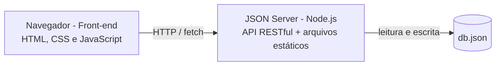

* **Front-end:** páginas HTML em `public/`, estilos em `public/assets/css/` e scripts em `public/assets/js/` e nas pastas dos módulos.
* **Back-end:** `index.js` inicializa o JSON Server na porta 3000, servindo os arquivos estáticos e a API.
* **Persistência:** arquivo `db/db.json`.

## Status das Funcionalidades

A tabela abaixo resume o estado atual de implementação de cada funcionalidade. Legenda: ✅ implementado · 🚧 parcial · ⬜ planejado.

| Funcionalidade | Status | Observações |
| --- | --- | --- |
| Login e cadastro de usuários | ✅ | Integrado à API `/usuarios` |
| Cadastro de animais (Resgatar) | ✅ | Grava em `/animais`, requer login |
| Perfil do usuário | ✅ | Lê `/usuarios` e `/animais` |
| Loja de produtos e carrinho | ✅ | Lê `/produtos`, registra pedido em `/pedidos` |
| Configurações | 🚧 | Modo escuro e idioma funcionam (localStorage); ainda não persiste em `/settings` |
| Mensagens (chat) | 🚧 | Interface funcional com dados locais; ainda não usa a coleção `/mensagens` |
| Reportar animal | 🚧 | Tela e formulário prontos; ainda não persiste na API |
| Contato | 🚧 | Tela e formulário prontos; ainda não persiste na API |
| Ranking e casos de sucesso | 🚧 | Tela pronta; consome `/resgatadores` e `/historias`, ainda não criadas no `db.json` |
| Match / adoção pelo adotante | ⬜ | Funcionalidade central planejada; ainda não implementada |
| Clínicas veterinárias | ⬜ | Prevista no design; sem módulo nem coleção de dados |
| Parcerias | ⬜ | Item de menu previsto; sem tela correspondente |

## Vídeo do Projeto

O vídeo de apresentação do problema e da solução está disponível no link abaixo.

> Link do vídeo: _pendente — inserir a URL do vídeo de apresentação do grupo._

## Funcionalidades

A seguir são apresentadas as funcionalidades implementadas na solução.

##### Funcionalidade 1 — Login e Cadastro de Usuários

Permite que o usuário se cadastre na plataforma e efetue login. A autenticação valida login e senha contra os registros da API e mantém a sessão do usuário corrente no `sessionStorage` do navegador.

* **Estrutura de dados:** [Usuários](#estrutura-de-dados---usuarios)
* **Módulo:** `public/modulos/login/` e `public/assets/js/login.js`
* **Instruções de acesso:**
  * Acesse `http://localhost:3000/modulos/login/login.html`
  * Para entrar, use um usuário existente (ex.: login `admin`, senha `123`)
  * Para criar uma conta nova, clique em **Registrar** e preencha o formulário

##### Funcionalidade 2 — Cadastro de Animais para Adoção (Resgatar)

Permite que um usuário logado cadastre um animal para adoção, informando tipo, nome, idade, porte, gênero, peso, localização, condição de saúde, temperamento e descrição. O registro é enviado para a API e passa a ficar vinculado ao usuário.

* **Estrutura de dados:** [Animais](#estrutura-de-dados---animais)
* **Módulo:** `public/modulos/henrique-souza-telas/registroPet.html` e `public/assets/js/registroPet.js`
* **Instruções de acesso:**
  * Efetue login
  * Acesse a opção **Resgatar** / Cadastrar Animal
  * Preencha o formulário e clique em **Cadastrar Animal**

##### Funcionalidade 3 — Perfil do Usuário

Exibe os dados do usuário logado (nome, login, bio, localização, contato) e a lista de animais cadastrados por ele, calculando estatísticas como total de resgates, adoções e taxa de adoção.

* **Estrutura de dados:** [Usuários](#estrutura-de-dados---usuarios), [Animais](#estrutura-de-dados---animais)
* **Módulo:** `public/modulos/henrique-souza-telas/userPerfil.html` e `public/assets/js/userPerfil.js`
* **Instruções de acesso:**
  * Efetue login
  * Acesse a opção **Perfil**

##### Funcionalidade 4 — Loja de Produtos e Carrinho de Compras

Apresenta um catálogo de produtos para pets carregado da API, com filtro por categoria e página de detalhe de cada produto. O usuário pode adicionar itens ao carrinho (armazenado no `localStorage`) e finalizar a compra, o que registra um pedido na API.

* **Estrutura de dados:** [Produtos](#estrutura-de-dados---produtos), [Pedidos](#estrutura-de-dados---pedidos)
* **Módulo:** `public/modulos/pedro-aguiar/` (`index.html`, `produto.html`, `produtos.js`, `carrinho.js`, `pedro-loja-api.js`)
* **Instruções de acesso:**
  * Acesse `http://localhost:3000/modulos/pedro-aguiar/index.html`
  * Navegue pelos produtos, use o filtro de categorias e adicione itens ao carrinho
  * Clique no carrinho e em **Finalizar compra** (é necessário estar logado)

##### Funcionalidade 5 — Ranking e Casos de Sucesso

Apresenta um ranking de resgatadores e uma galeria de casos de sucesso (adoções concluídas), valorizando os usuários mais ativos da plataforma.

* **Estrutura de dados:** `resgatadores` e `historias` (consumidas pela tela de ranking)
* **Módulo:** `public/modulos/henrique-souza-telas/ranking.html` e `public/assets/js/ranking.js`
* **Instruções de acesso:**
  * Acesse a opção **Ranking** no menu

##### Funcionalidade 6 — Configurações

Permite ajustar preferências do usuário, como modo escuro (persistido no `localStorage`), idioma (português/inglês) e tipo de perfil, além de campos de informações pessoais, contato e segurança. Inclui máscara automática para o campo de telefone.

* **Estrutura de dados:** [Settings](#estrutura-de-dados---settings)
* **Módulo:** `public/modulos/Arthur-Lopes-telas/settings.html` e `public/assets/js/settings.js`
* **Instruções de acesso:**
  * Acesse a opção **Configurações**

##### Funcionalidade 7 — Mensagens (Chat)

Tela de conversas no estilo de aplicativos de mensagens, permitindo a troca de mensagens entre adotante e resgatador sobre um animal específico.

* **Estrutura de dados:** [Mensagens](#estrutura-de-dados---mensagens)
* **Módulo:** `public/modulos/Arthur-Lopes-telas/talk.html` e `public/assets/js/script.js`

##### Funcionalidade 8 — Reportar Animal de Rua

Formulário para que qualquer pessoa reporte um animal em situação de rua, informando localização, descrição da situação, nível de urgência, contato e foto opcional. Exibe também um painel com reportes recentes.

* **Módulo:** `public/modulos/telas ronan/reportar.html`
* **Instruções de acesso:**
  * Acesse a opção **Reportar** no menu

##### Funcionalidade 9 — Contato

Formulário de contato com campos para nome, e-mail, telefone, assunto e mensagem, acompanhado das informações de contato e do horário de atendimento da plataforma.

* **Módulo:** `public/modulos/telas ronan/contato.html`
* **Instruções de acesso:**
  * Acesse a opção **Contato** no menu

## Estruturas de Dados

Descrição das estruturas de dados utilizadas na solução, definidas no arquivo `codigo/db/db.json` e disponibilizadas pela API REST do JSON Server. Para o JSON Server, toda estrutura precisa de um atributo identificador chamado `id`.

##### Estrutura de Dados - Usuários

Registro dos usuários do sistema, utilizado para login e para o perfil.

```json
{
  "id": 1,
  "login": "admin",
  "senha": "123",
  "nome": "Administrador do Sistema",
  "email": "admin@abc.com"
}
```

##### Estrutura de Dados - Animais

Animais cadastrados para adoção na plataforma.

```json
{
  "id": 1,
  "nome": "Rex",
  "idade": "2 anos",
  "cidade": "Belo Horizonte",
  "imagem": "https://placedog.net/500",
  "descricao": "Cachorro brincalhão"
}
```

> Os animais cadastrados pela tela **Resgatar** incluem ainda os campos `tipo`, `porte`, `genero`, `peso`, `localizacao`, `saude`, `temperamento`, `status`, `usuarioId` e `dataCadastro`.

##### Estrutura de Dados - Produtos

Produtos para pets exibidos na loja.

```json
{
  "id": 1,
  "nome": "Shampoo Hipoalergênico",
  "categoria": "Higiene",
  "preco": 28.5,
  "avaliacao": 4.5,
  "imagem": "https://images.unsplash.com/photo-1584305574647-0cc949a2bb9f?w=400&h=300&fit=crop",
  "descricao": "Shampoo suave para peles sensíveis, ideal para cães e gatos.",
  "descricaoDetalhada": "Fórmula dermatologicamente testada, sem parabenos e com pH balanceado para a pele dos pets.",
  "especificacoes": [
    "Volume: 500 ml",
    "Sem corantes artificiais",
    "Aroma leve e neutro",
    "Uso em cães e gatos adultos"
  ]
}
```

##### Estrutura de Dados - Pedidos

Pedidos gerados ao finalizar uma compra na loja.

```json
{
  "id": 1,
  "usuarioId": 1,
  "usuarioNome": "Administrador do Sistema",
  "itens": [
    { "produtoId": 1, "nome": "Shampoo Hipoalergênico", "preco": 28.5 }
  ],
  "total": 28.5,
  "data": "2026-06-02T08:30:00Z"
}
```

##### Estrutura de Dados - Mensagens

Mensagens trocadas entre usuários da plataforma.

```json
{
  "id": 1,
  "remetenteId": 3,
  "destinatarioId": 1,
  "conteudo": "Olá, tudo bem?",
  "data": "2026-06-02T08:30:00Z"
}
```

##### Estrutura de Dados - Settings

Preferências de configuração da aplicação.

```json
{
  "id": 1,
  "darkMode": false,
  "language": "pt"
}
```

## Modelo de Dados

O diagrama a seguir apresenta as principais entidades e seus relacionamentos. O usuário é a entidade central: ele cadastra animais, realiza pedidos e participa das mensagens.

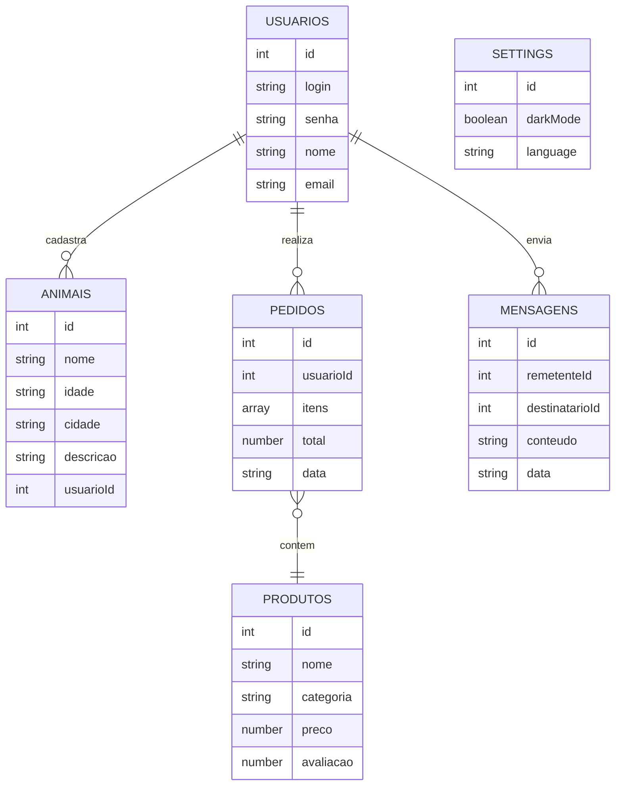

Relacionamentos principais:

* `animais.usuarioId` → `usuarios.id` (cada animal pertence ao usuário que o cadastrou)
* `pedidos.usuarioId` → `usuarios.id` (cada pedido pertence a um usuário)
* `pedidos.itens[].produtoId` → `produtos.id` (cada item de pedido referencia um produto)
* `mensagens.remetenteId` / `mensagens.destinatarioId` → `usuarios.id`

## Rotas da API

O JSON Server gera automaticamente um conjunto de rotas REST para cada coleção do `db.json`. A base local é `http://localhost:3000`.

| Método | Rota | Descrição |
| --- | --- | --- |
| GET | `/usuarios` | Lista todos os usuários |
| POST | `/usuarios` | Cadastra um novo usuário |
| GET | `/animais` | Lista os animais cadastrados |
| GET | `/animais?usuarioId={id}` | Lista os animais de um usuário |
| POST | `/animais` | Cadastra um novo animal |
| GET | `/produtos` | Lista os produtos da loja |
| GET | `/produtos/{id}` | Detalha um produto específico |
| GET | `/pedidos` | Lista os pedidos |
| POST | `/pedidos` | Registra um novo pedido |
| GET | `/mensagens` | Lista as mensagens |
| GET | `/settings` | Retorna as preferências da aplicação |

> Além dessas, o JSON Server também suporta `PUT`, `PATCH` e `DELETE` em cada recurso, bem como parâmetros de ordenação (`_sort`, `_order`) e filtros por campo.

## Módulos e APIs

Esta seção apresenta os módulos, bibliotecas e APIs utilizados na solução.

**Ambiente e back-end:**

* [Node.js](https://nodejs.org/) — ambiente de execução JavaScript
* [JSON Server](https://www.npmjs.com/package/json-server) — API RESTful a partir do `db.json`
* [Express](https://expressjs.com/) — servidor web (dependência do JSON Server)

**Front-end e bibliotecas:**

* [Bootstrap 5](https://getbootstrap.com/) e [Bootstrap Icons](https://icons.getbootstrap.com/) — utilizados na tela de login
* [jQuery](https://jquery.com/) — utilizado no controle do modal de cadastro de login

**Imagens utilizadas (fontes externas):**

* [Unsplash](https://unsplash.com/) — imagens de produtos, pets e banners
* [place.dog](https://placedog.net/) — imagens de exemplo de cães
* [The Cat API](https://thecatapi.com/) — imagens de exemplo de gatos

**Armazenamento no navegador:**

* `sessionStorage` — sessão do usuário logado (`usuarioCorrente`)
* `localStorage` — carrinho de compras e preferência de modo escuro

# Referências

As referências utilizadas no trabalho foram:

* INSTITUTO PET BRASIL. Censo Pet: população de cães e gatos no Brasil. Disponível em: https://institutopetbrasil.com/. Acesso em: 2026.
* ORGANIZAÇÃO MUNDIAL DA SAÚDE (OMS). Dados sobre população de animais em situação de rua. Disponível em: https://www.who.int/. Acesso em: 2026.
